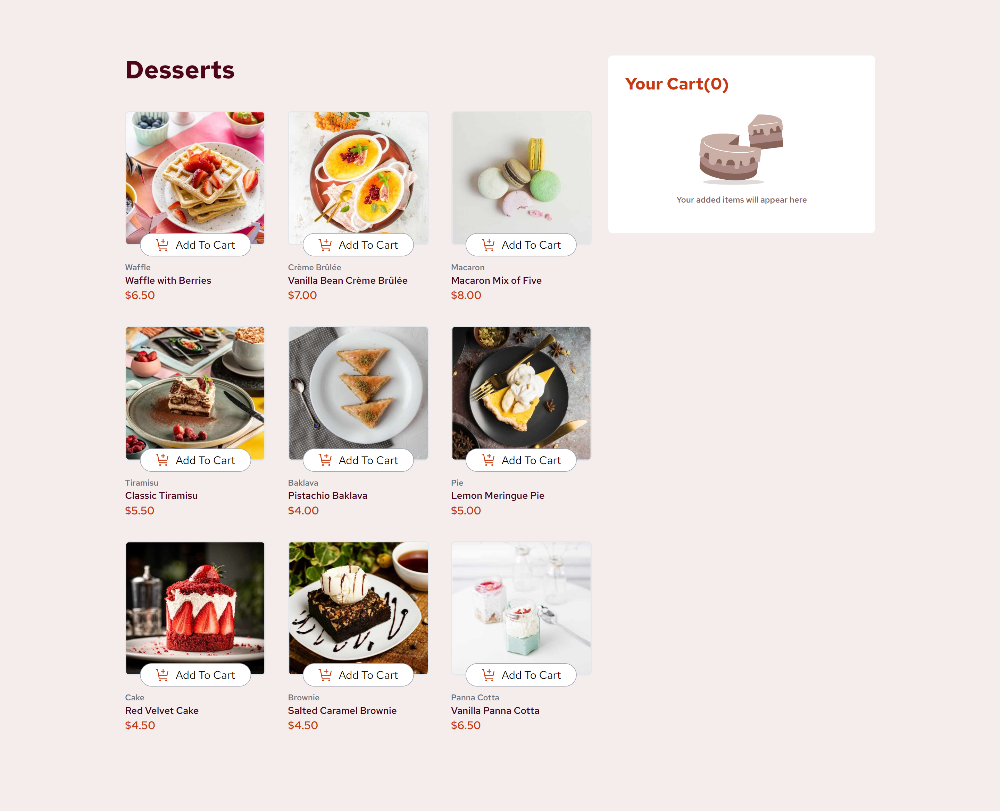

# Frontend Mentor - Product list with cart solution

This is a solution to the [Product list with cart challenge on Frontend Mentor](https://www.frontendmentor.io/challenges/product-list-with-cart-5MmqLVAp_d). Frontend Mentor challenges help you improve your coding skills by building realistic projects. 

## Table of contents

- [Overview](#overview)
  - [The challenge](#the-challenge)
  - [Screenshot](#screenshot)
  - [Links](#links)
- [My process](#my-process)
  - [Built with](#built-with)
  - [What I learned](#what-i-learned)
  - [Continued development](#continued-development)
  - [Useful resources](#useful-resources)
- [Author](#author)
- [Acknowledgments](#acknowledgments)

## Overview

### The challenge

Users should be able to:

- Add items to the cart and remove them
- Increase/decrease the number of items in the cart
- See an order confirmation modal when they click "Confirm Order"
- Reset their selections when they click "Start New Order"
- View the optimal layout for the interface depending on their device's screen size
- See hover and focus states for all interactive elements on the page

### Screenshot

### Links

- Solution URL: [https://github.com/Andigashi1/product-list](https://github.com/Andigashi1/product-list)
- Live Site URL: [https://product-list-neon.vercel.app/](https://product-list-neon.vercel.app/)

## My process

### Built with

- Semantic HTML5 markup
- CSS custom properties
- Flexbox
- CSS Grid
- [React](https://reactjs.org/) - JS library
- [Tailwind](https://tailwindcss.com/) - CSS framework

### Continued development

I didn't use the useContext() hook in this projects although it would be optimal to however i wasn't familiar with it.
I plan to be more familiar with the react hooks and i plan to learn React router and a database of my choice in the near future.

### Useful resources

- [Tailwind Documentation](https://tailwindcss.com/) - This helped me find the right utility classes for the styles i wanted to apply as it was the first time i used tailwind in a solo project.
- [React Documentation](https://www.example.com) - I read the documentation and was able to improve my react code e.g. removing redundant state, lifting state up in the tree.

## Author

- Frontend Mentor - [@Andigashi1](https://www.frontendmentor.io/profile/Andigashi1)
- LinkedIn - [@Andi Gashi](www.linkedin.com/in/andi-gashi2004)

